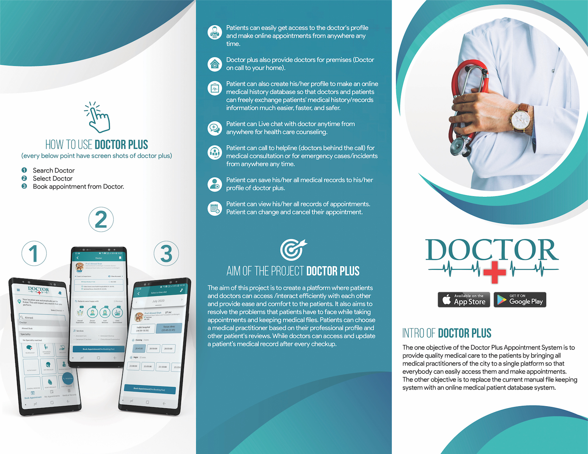
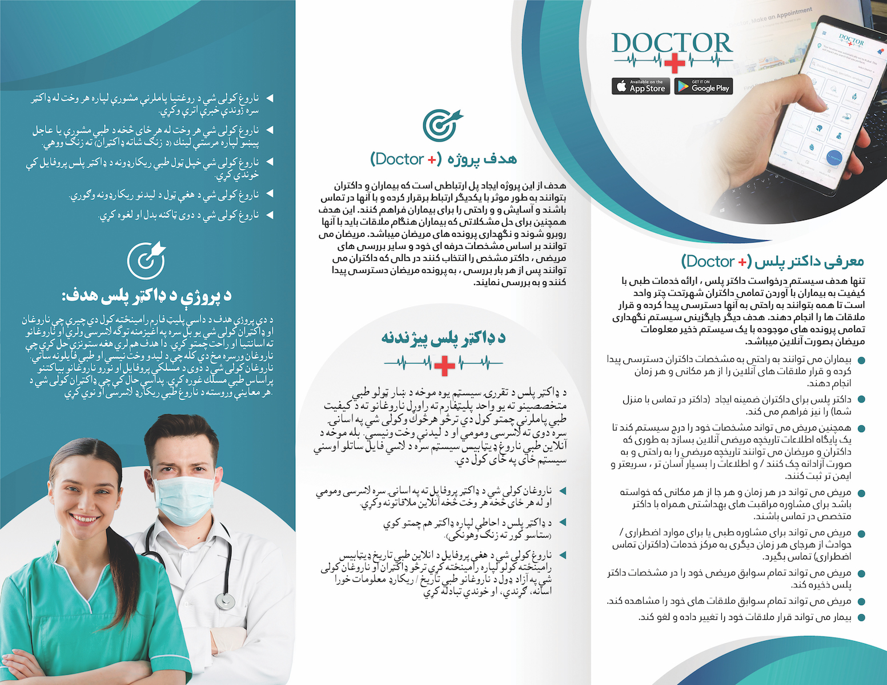

# (Legacy) Doctor Plus - Mobile App

Doctor Plus is a groundbreaking mobile application developed in affiliation with the Ministry of Health in Afghanistan. This app is a key component of the larger Doctor Plus project, which aims to digitize and streamline various activities within the Ministry of Health. By collecting and utilizing data across multiple platforms, Doctor Plus provides invaluable insights and services that improve healthcare delivery throughout the country.

## Overview

Doctor Plus is part of a larger ecosystem that includes multiple mobile applications, websites, and microservices, all designed to enhance the efficiency and accessibility of healthcare services in Afghanistan. The app centralizes essential healthcare information, enabling users to easily find doctors, book appointments, and manage their medical history.

## Features

### General Functionality

- **Doctor Search:** Patients can search for doctors by name, specialty, and location (city or province).
- **Recommendations:** The system recommends the highest-rated doctors based on patient reviews and ratings.
- **Doctor Information:** View key details such as specialty, rating, and clinic address in the doctor list.
- **Doctor Profile:** Access comprehensive profiles of doctors, including their qualifications and availability.
- **Appointment Booking:** Check available time slots and book appointments directly through the app.
- **Favorites:** Patients can bookmark and manage a list of their favorite doctors for easy access.
- **Doctor Plus Services Hotline:** The Home Page features a hotline number for emergencies and further assistance.

### Patient Profile

- **Medical History:** Patients can maintain a detailed medical history, including past visits, diagnoses, prescriptions, and attending doctors.
- **Profile Management:** Update personal information such as name, address, and age to ensure accurate medical records.
- **Family Management:** Add and manage family members within the app, allowing doctors to treat them as individual patients.

### Appointment Management

- **Single Appointment Rule:** Patients can only book one appointment with the same doctor at a time.
- **Family Appointments:** Schedule appointments for family members, adhering to the same rules as individual patients.
- **Rescheduling & Cancellation:** Easily reschedule or cancel appointments, with notifications sent in case of cancellations by the doctor.

### Chat Functionality

- **Doctor-Patient Chat:** Engage in conversations with doctors after a successful appointment, with options to send text, files, and voice messages.
- **Notification System:** Receive messages from doctors even without a completed appointment, ensuring continuous communication.

## Doctor Plus Ecosystem - Related Projects

Doctor Plus is part of a broader initiative that includes various related services:

- **[Doctor Plus](https://github.com/arifhaidari/doctor_plus)**
- **[Doctor Practice](https://github.com/arifhaidari/doctor_practice)**
- **[Doctor Plus Website](https://github.com/arifhaidari/doctor_plus_web)**
- **[Legacy Version of Doctor Practice](https://github.com/arifhaidari/legacy_doctor_practice)**
- **[Doctor Registration, License, and Clinic](#)**
- **[News & More](#)**

Explore these platforms for more information about how Doctor Plus is revolutionizing healthcare in Afghanistan.

---

## License

This project is licensed under the terms of the **Copyright © 2020 Arif Haidari and FSH**.

This project was originally private and has been made public for educational and portfolio purposes only. The code, design, or any other materials may not be used, copied, modified, merged, published, distributed, sublicensed, or sold for production or commercial purposes without explicit permission from the copyright holder.

Please respect the intellectual property rights and refrain from using this project for any production or commercial USE.

---

## Contact

For any inquiries, please contact:

**Arif Haidari**  
Email: [arifhaidari336@gmail.com](mailto:arifhaidari336@gmail.com)

---
